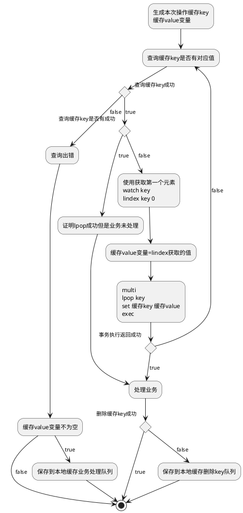

# 网易博客已被封,解封很麻烦,删除日志不进回收站,刷新网页又回来了,只能彻底删除,而彻底删除之后也就个空号了

# 300多篇日志现在都迁移过来了,毕竟maximo资料太少,给大家做点贡献吧

# ---------------------------------------蒋カイセキ(蒋校长) 笔


# 博客转移为markdown语法




```Java
public static void main(String[] age){
   System.out.println("Hello world");
}
```

## 目录1
-  `1=#c00000`

## 目录2


